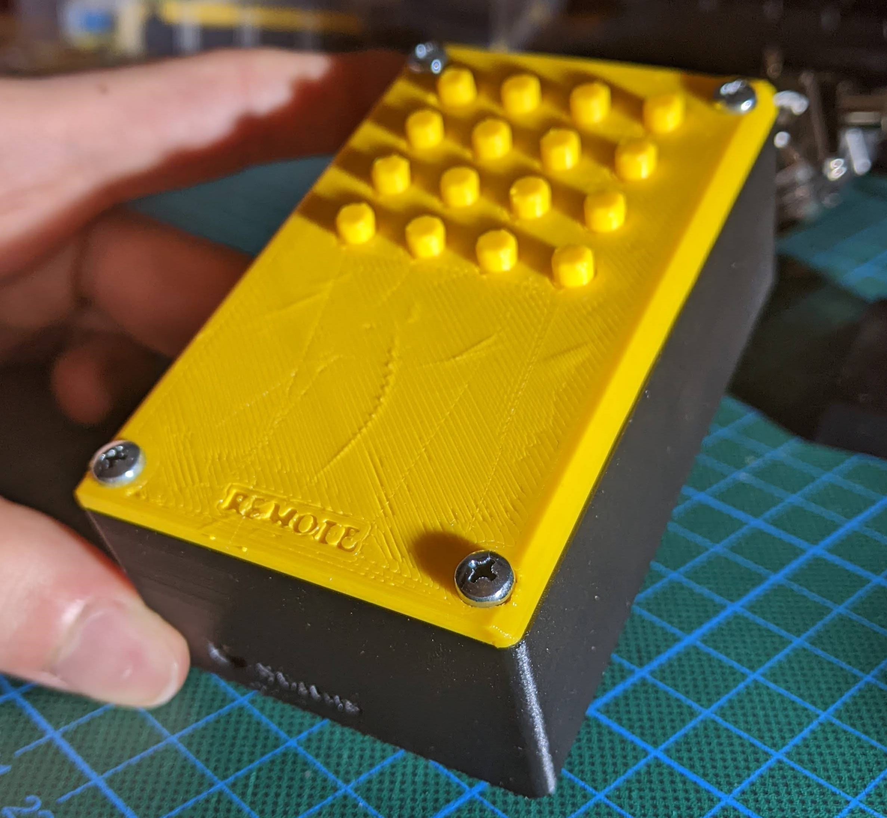
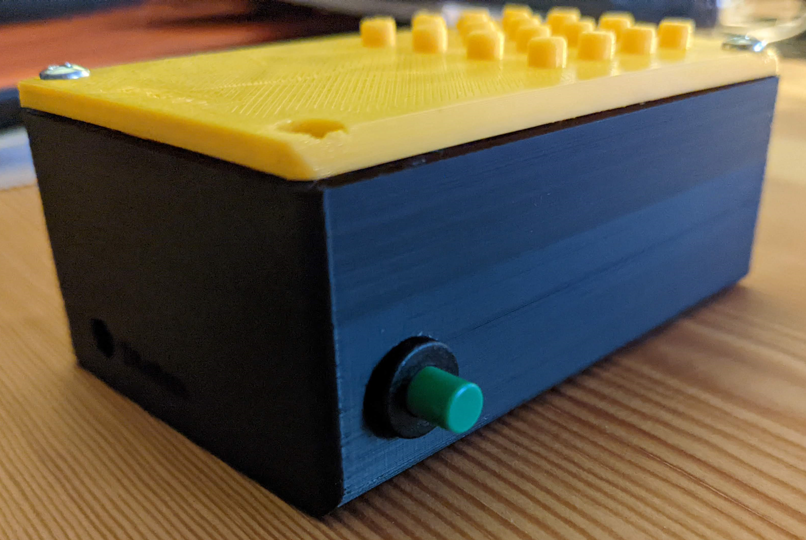

# 16 Button ESP32 Keypad MQTT Remote

A personal project to send arbitrary signals to any device with a wireless battery-powered 16 button keypad and an
ESP32.

## Building the project yourself

(just don't actually) (okay, if you really want, use this as reference, but don't just trust everything 100%)

You can find instructions on how to set up and build the project yourself in the following files:

- [General project setup using Platform IO and optionally CLion](setup/setup.md)
- [Set up your Raspberry Pi with NodeRed and mosquitto](setup/raspi-setup.md)
- [Build/Print the 3D casing](setup/casing-3d.md)

If you end up building this, feel free to let me know!
(don't complain about some of the issues though, there are a few that I can't be bothered to fix anymore)

## Post-Build changes I made

### Battery consumption issue

Since the battery consumption of the ESP was higher than I expected at first, I added a toggle that can fully disable
the ESP by cutting its power supply.
I am not listing the button I used, since I had a lot of trouble with it and can't recommend it.  
To install it, I cut the power (red) battery wire into two parts, where I attached each end to the individual pins of
the button.
I also changed the program to cache any inputs that are made during the initial Wi-Fi connection and have them be sent at
once after the connection is established to allow for immediate inputs.

Note that this hole isn't present in the model, I simply drilled a hole myself into the casing.

#### Flaws with this design:

- See the 3D printing section for flaws with the model.
- SOLVED: See above.  
  The battery consumption of the ESP32 is too high, it drains the three AA batteries in just a few days.
  I therefore added a switch afterward to fully turn off the device by cutting the power off.
