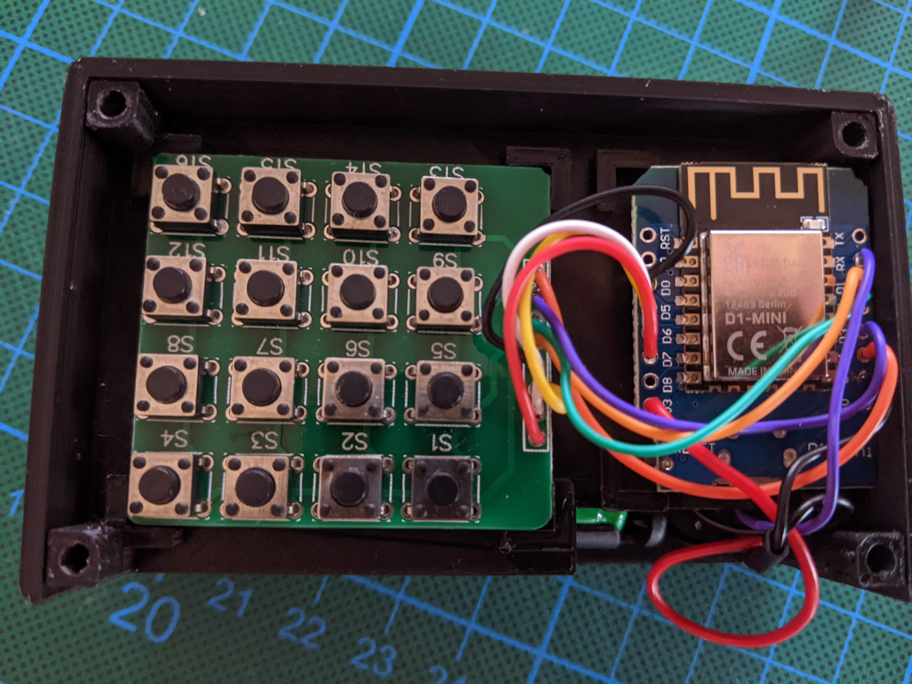
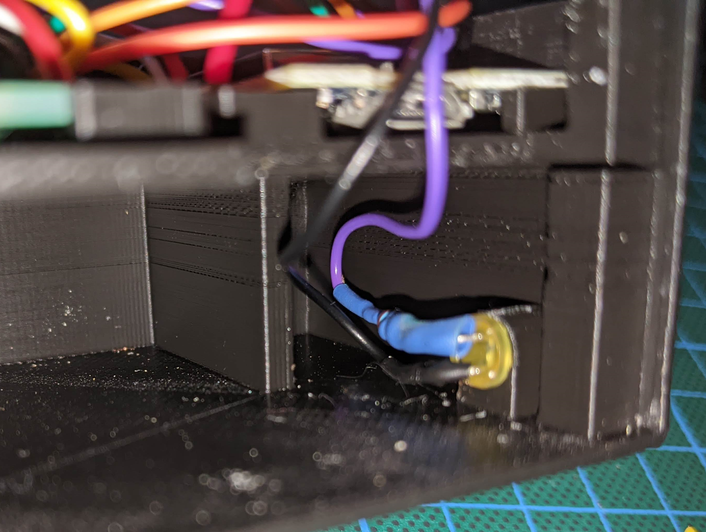
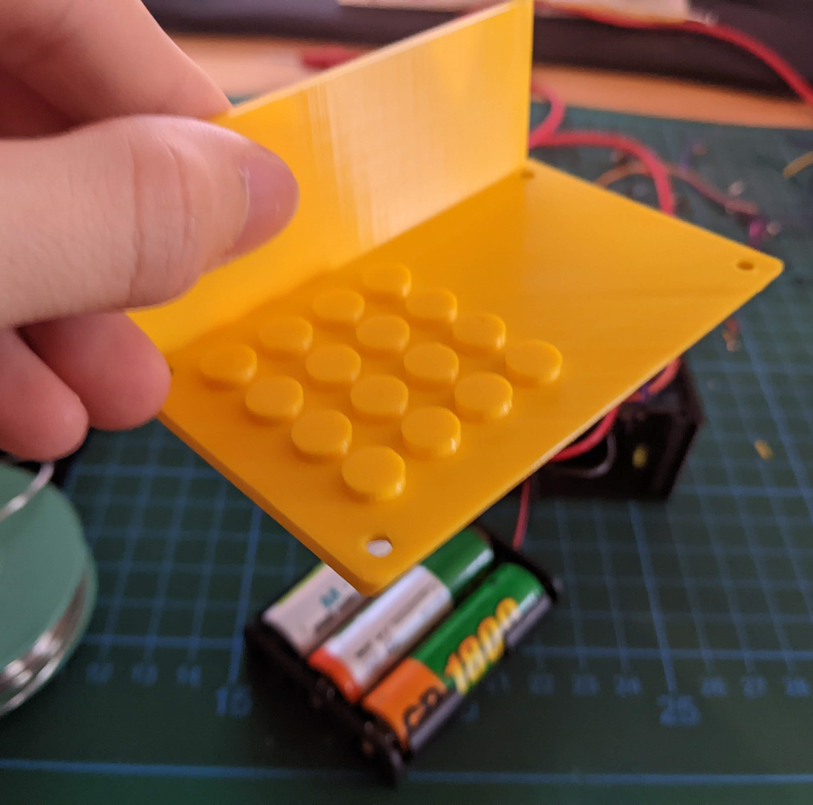

# Constructing the casing

## Components

| Component               | Dimensions (cm)                      | Notes        |
|-------------------------|--------------------------------------|--------------|
| 4x4 button matrix       | 4.25 x 3.85                          | 8 pins       |
| button on button matrix | 0.6 x 0.6 x 0.35, 0.35 x 0.35 x 0.15 | outer, inner |
| esp12e                  | 2.6 x 3.4                            |              |
| battery casing          | 5.8 x 4.7 x 1.4                      | 3 x AA       |
| Status LED              |                                      |              |

## Model

https://www.tinkercad.com/things/7XPZQP4vwFA-mighty-bojo

If you can't/don't want to use tinkercad, the model is also in the setup folder.
Make sure to separate them before printing.

### Issues with the model

- the inside is pretty crammed, there isn't much room for the wires
- the ESP32 is not contained hard enough, it can move around a tiny bit, but this didn't cause any issues for me
- the button pinholes on the cover don't align perfectly with the buttons on the matrix, but using the slightly larger
  pins to push them in works fine
- the base does not contain a hole for a switch for turning on and off the power, I drilled this myself into the side

## Assembly / Images

Just connect the pins of the matrix with any data pins on the ESP, just make sure to properly adjust your pins in the
code in the [ProjectConfig.h](../src/ProjectConfig.h). You can find my configuration there. You can see what pins are
responsible for which row/colum in the [keypad-board-pins.png](keypad-board-pins.png).

Make sure to connect (in my case) three AA batteries to the 3.3V input of the ESP and the ground to both the LED and the
ESP. Use an appropriate resistor for the LED.

Below, you can find some images of my setup.

Insert the pins before putting the cover on the remote control, turn the remote upside down with the open battery casing
on the upper side to prevent both the button pins and the battery casing to fall out and carefully slide the cover on.

