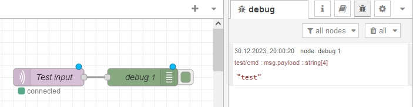
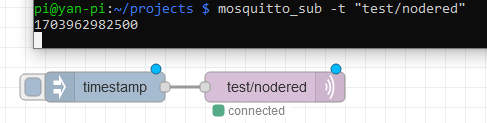

## Setting up the Raspberry Pi

### Install NodeRed

https://nodered.org/docs/getting-started/raspberrypi

I use version 20:

```bash
bash <(curl -sL https://raw.githubusercontent.com/node-red/linux-installers/master/deb/update-nodejs-and-nodered) --node20
```

```
**********************************************************************************
 ### WARNING ###
 DO NOT EXPOSE NODE-RED TO THE OPEN INTERNET WITHOUT SECURING IT FIRST

 Even if your Node-RED doesn't have anything valuable, (automated) attacks will
 happen and could provide a foothold in your local network

 Follow the guide at https://nodered.org/docs/user-guide/runtime/securing-node-red
 to setup security.

 ### ADDITIONAL RECOMMENDATIONS ###
  - Remove the /etc/sudoers.d/010_pi-nopasswd file to require entering your password
    when performing any sudo/root commands:

      sudo rm -f /etc/sudoers.d/010_pi-nopasswd

  - You can customise the initial settings by running:

      node-red admin init

  - After running Node-RED for the first time, change the ownership of the settings
    file to 'root' to prevent unauthorised changes:

      sudo chown root:root ~/.node-red/settings.js

**********************************************************************************
```

Autostart the service:

```bash
sudo systemctl enable nodered.service
sudo systemctl start nodered.service
```

Check whether it is running:

```bash
sudo systemctl status nodered.service
```

Will be running on http://localhost:1880

### Install Mosquitto Server + Client for MQTT

https://mosquitto.org/download/
https://www.elektronik-kompendium.de/sites/raspberry-pi/2709041.htm

```bash
sudo apt install mosquitto mosquitto-clients
sudo systemctl enable mosquitto
sudo systemctl start mosquitto
mosquitto -h
```

Optionally specify config file:

```bash
sudo nano /etc/mosquitto/conf.d/auth.conf
```

with

```
listener 1883
allow_anonymous true
```

### Testing MQTT and NodeRed

```bash
mosquitto_pub -t "test/cmd" -m test
```



```bash
mosquitto_sub -t "test/cmd"
```


