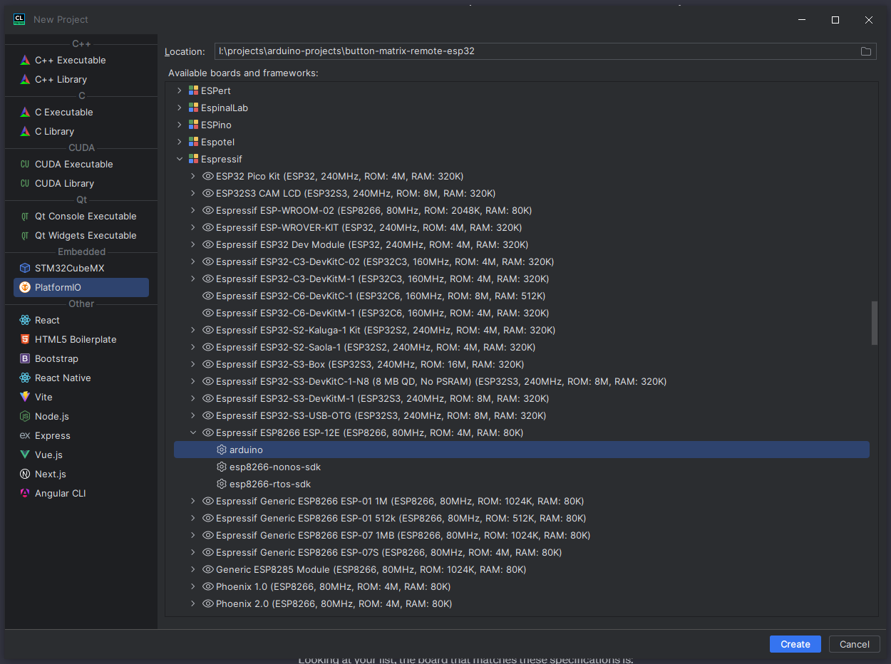
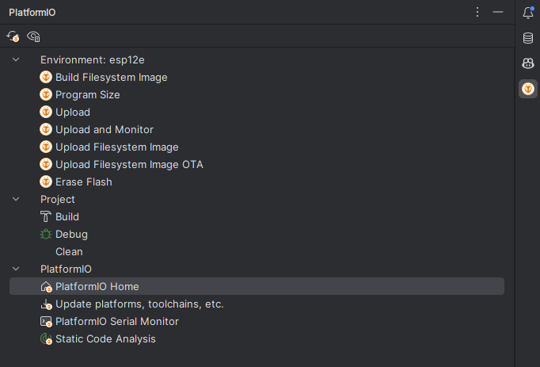
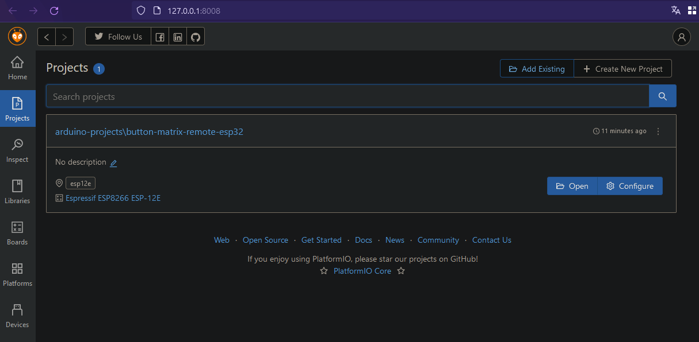
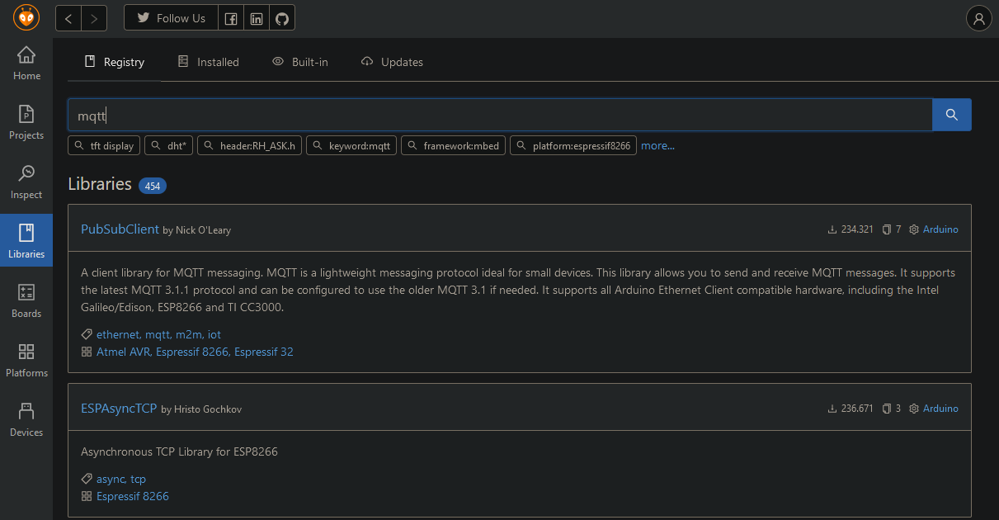
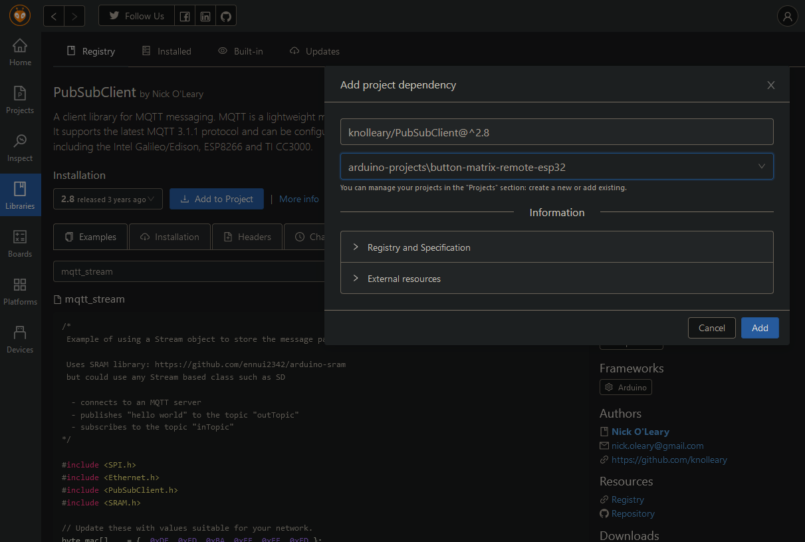
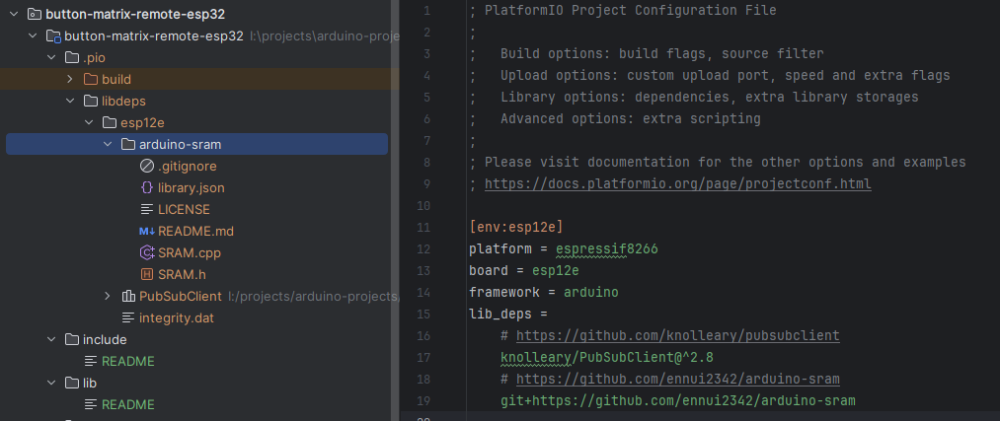
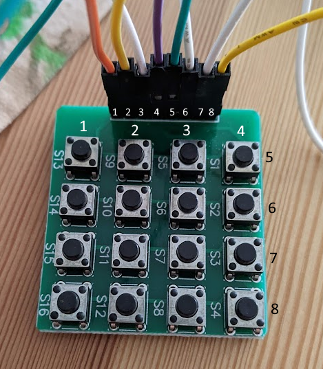

## CLion Setup

### Platform IO

Using https://blog.jetbrains.com/clion/2020/08/arduino-from-hobby-to-prof-p1/ as a guide, install

- Platform IO
- Platform IO CLion Plugin

https://docs.platformio.org/en/latest/core/installation/methods/installer-script.html

```shell
curl -fsSL -o get-platformio.py https://raw.githubusercontent.com/platformio/platformio-core-installer/master/get-platformio.py
python3 get-platformio.py
```

Add whatever path it tells you it installed to to your PATH, e.g. C:\Users\%USERNAME%\.platformio\penv\Scripts

### Setup project







### Add a library

https://community.platformio.org/t/how-to-include-arduino-library-in-platformio/15146

> The preferred way is to NOT download the Arduino library yourself.
> Instead go to PIO Home / Libraries (in Visual Studio Code) or to PlatformIO Registry and search for the library.

https://docs.platformio.org/en/latest/core/userguide/pkg/cmd_install.html#cmd-pkg-install





Will result in:

```ini
[env:esp12e]
platform = espressif8266
board = esp12e
framework = arduino
lib_deps = knolleary/PubSubClient@^2.8
```

### Add a library that is unknown to the package manager

You can simply list a git repository or file (see syntax from link in chapter above) in your libraries and it will clone
it into the lib folder.

```ini
lib_deps =
# https://github.com/knolleary/pubsubclient
    knolleary/PubSubClient@^2.8
# https://github.com/ennui2342/arduino-sram
    git+https://github.com/ennui2342/arduino-sram
```



Removing dependencies from the platformio.ini file will usually remove the library from the lib folder.

## Keypad




```c++
constexpr byte ROWS = 4;
constexpr byte COLS = 4;

char keys[ROWS][COLS] = {
    {'1', '2', '3', '4'},
    {'5', '6', '7', '8'},
    {'9', 'A', 'B', 'C'},
    {'D', 'E', 'F', 'G'}
};

byte rowPins[ROWS] = {16, 14, 12, 13}; // 4 3 2 1
byte colPins[COLS] = {5, 4, 0, 2}; // 5 6 7 8

Keypad keypad = Keypad(makeKeymap(keys), rowPins, colPins, ROWS, COLS);
```

## Build the project

For this project in particular:

```shell
pio run -t upload -t monitor
pio run -t upload -t monitor -e esp12e
```

The specification of the environment seems optional, if you only have one environment. The platformio.ini file contains
the `[env:esp12e]` environment.

`pio` has the following arguments:

```shell
Options:
  -e, --environment TEXT
  -t, --target TEXT
  --upload-port TEXT
  --monitor-port TEXT
  -d, --project-dir PATH
  -c, --project-conf FILE
  -j, --jobs INTEGER       Allow N jobs at once. Default is a number of CPUs
                           in a system (N=16)
  -a, --program-arg TEXT   A program argument (multiple are allowed)
  --disable-auto-clean
  --list-targets
  -s, --silent
  -v, --verbose
  -h, --help               Show this message and exit.
```
